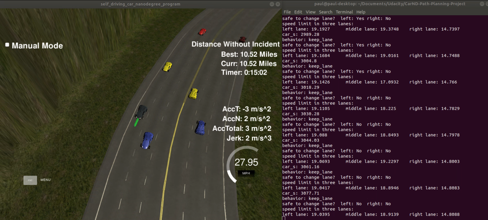
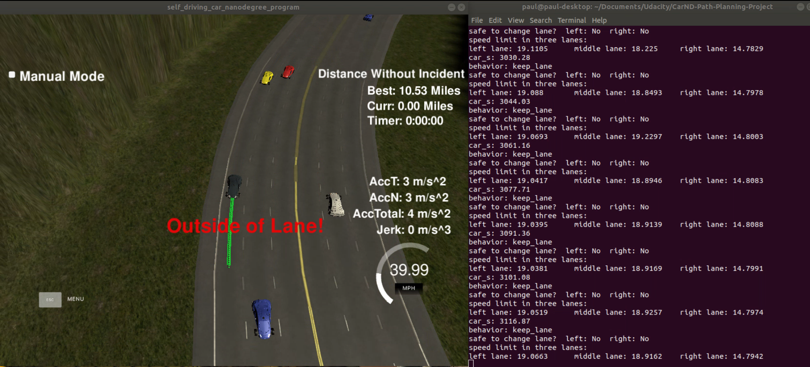
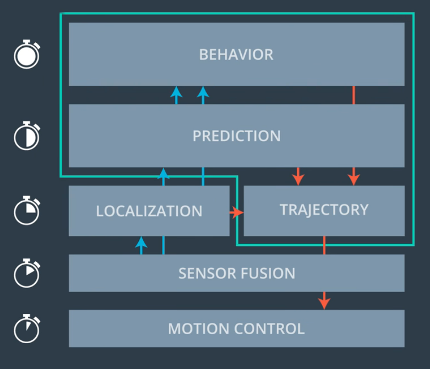
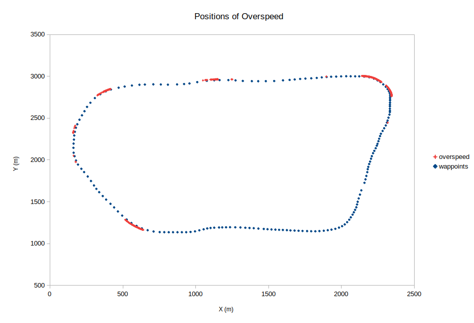
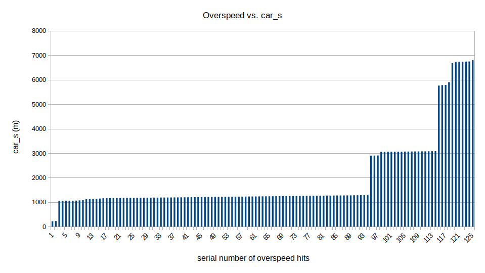

# CarND-Path-Planning-Project
Self-Driving Car Engineer Nanodegree Program

##### Author: Pengmian Yan

##### Created on: Mar 11, 2019

## 1. Project Introduction

In this project, I designed a path planner that is able to create smooth, safe paths for the car to follow along a 3 lane highway with traffic. This path planner it is able to keep car inside its lane, avoid hitting other cars, and pass slower moving traffic.

The car drives around a virtual highway (6946m long) with other traffic that is driving +-10 MPH of the 50 MPH speed limit. The car's localization, sensor fusion data and a sparse map list of waypoints around the highway are provided. The car tries to go as close as possible to the 50 MPH speed limit, which means passing slower traffic when possible, note that other cars will try to change lanes too. The car will avoid hitting other cars at all cost as well as driving inside of the marked road lanes at all times, unless going from one lane to another. 


## 2. Demo of Result

As a result my path planner passed the [project rubic](https://review.udacity.com/#!/rubrics/1971/view) of Udacity. The car drove 10.52 miles (about two and half highway track) in simulator without incident, which means it didn't collide with any other cars or ever experience total  acceleration over 10 m/s^2 and jerk that is greater than 10 m/s^3 or any overspeed. 

As shown below, left is the situation in simulator. The text "Manual Mode" is misleading, as the car war driving autonomously. On the right side we can see the result of behavior planning, the safety check for possible lane changing and  the computed speed limit of each lane on the highway in meter per second. 

[The Whole Video](https://www.youtube.com/watch?v=eKTWSSR4kXg&t=31s)



At 10.53 miles "went the car out of lane", which, I suppose, was attributed to a bug of the simulator. As we can see below, the car was actually still in the lane. After that the car drove normally further. I have also a self-check for "out of lane" in lane 126 - 129 in main.cpp, which will abort the program if the car is out of lane. 




## 3. Running the Code

### 3.1 Simulator.

You can download the Term3 Simulator which contains the Path Planning Project from the [releases tab (https://github.com/udacity/self-driving-car-sim/releases/tag/T3_v1.2).  

To run the simulator on Mac/Linux, first make the binary file executable with the following command:
```shell
sudo chmod u+x {simulator_file_name}
```

### 3.2 Dependencies

- cmake >= 3.5

  - All OSes: [click here for installation instructions](https://cmake.org/install/)

- make >= 4.1

  - Linux: make is installed by default on most Linux distros
  - Mac: [install Xcode command line tools to get make](https://developer.apple.com/xcode/features/)
  - Windows: [Click here for installation instructions](http://gnuwin32.sourceforge.net/packages/make.htm)

- gcc/g++ >= 5.4

  - Linux: gcc / g++ is installed by default on most Linux distros
  - Mac: same deal as make - [install Xcode command line tools]((https://developer.apple.com/xcode/features/)
  - Windows: recommend using [MinGW](http://www.mingw.org/)

- [uWebSockets](https://github.com/uWebSockets/uWebSockets)

  - Run either `install-mac.sh` or `install-ubuntu.sh`.

  - If you install from source, checkout to commit `e94b6e1`, i.e.

    ```
    git clone https://github.com/uWebSockets/uWebSockets 
    cd uWebSockets
    git checkout e94b6e1
    ```

### 3.3 Basic Build Instructions

1. Clone this repo.
2. Make a build directory: `mkdir build && cd build`
3. Compile: `cmake .. && make`
4. Run it: `./path_planning`.

or 

1. Clone this repo.
2. Run the script : `./sh test.sh`


## 4. Input to the path planner

Here is the data provided from the Simulator to the C++ Program

#### 4.1 The map of the highway is in data/highway_map.txt

Each waypoint in the list contains  [x,y,s,dx,dy] values. x and y are the waypoint's map coordinate position, the s value is the distance along the road to get to that waypoint in meters, the dx and dy values define the unit normal vector pointing outward of the highway loop.

The highway's waypoints loop around so the frenet s value, distance along the road, goes from 0 to 6945.554.

#### 4.2 Main car's localization Data (No Noise)

["x"] The car's x position in map coordinates

["y"] The car's y position in map coordinates

["s"] The car's s position in frenet coordinates

["d"] The car's d position in frenet coordinates

["yaw"] The car's yaw angle in the map

["speed"] The car's speed in MPH

#### 4. 3 Previous path data given to the Planner

//Note: Return the previous list but with processed points removed, can be a nice tool to show how far along the path has processed since last time. 

["previous_path_x"] The previous list of x points previously given to the simulator

["previous_path_y"] The previous list of y points previously given to the simulator

#### 4.5 Previous path's end s and d values 

["end_path_s"] The previous list's last point's frenet s value

["end_path_d"] The previous list's last point's frenet d value

#### 4.6 Sensor Fusion Data, a list of all other car's attributes on the same side of the road. (No Noise)

["sensor_fusion"] A 2d vector of cars and then that car's [car's unique ID, car's x position in map coordinates, car's y position in map coordinates, car's x velocity in m/s, car's y velocity in m/s, car's s position in frenet coordinates, car's d position in frenet coordinates. 

#### 4.7 Details

1. The car uses a perfect controller and will visit every (x,y) point it recieves in the list every .02 seconds. The units for the (x,y) points are in meters and the spacing of the points determines the speed of the car. The vector going from a point to the next point in the list dictates the angle of the car. Acceleration both in the tangential and normal directions is measured along with the jerk, the rate of change of total Acceleration. The (x,y) point paths that the planner recieves should not have a total acceleration that goes over 10 m/s^2, also the jerk should not go over 50 m/s^3. (NOTE: As this is BETA, these requirements might change. Also currently jerk is over a .02 second interval, it would probably be better to average total acceleration over 1 second and measure jerk from that.

2. There will be some latency between the simulator running and the path planner returning a path, with optimized code usually its not very long maybe just 1-3 time steps. During this delay the simulator will continue using points that it was last given, because of this its a good idea to store the last points you have used so you can have a smooth transition. previous_path_x, and previous_path_y can be helpful for this transition since they show the last points given to the simulator controller with the processed points already removed. You would either return a path that extends this previous path or make sure to create a new path that has a smooth transition with this last path.

   

### 5. Implementation of my path planer

### 5.1 Frenet coordinate system

This path planner uses Frenet coordinate system, because the car should drive the curvy highway and we have the map provided. 


### 5.2 System Architecture

As shown in figure below, there is a usual chain for a self-driving car. I implemented the three modules in  the turquoise color frame:

1. Prediction
2. Behavior Planning
3. Trajectory Generation. 

Normally we have different cycle time for the modules, but I just simply update the prediction and behavior every one second and generate the trajectory with a variable frequency depending on the behavior decided. 



### 5.3 Code Structure

All my codes are in the folder "src". 

The directory structure of this repository is as follows:

```
root
|   build.sh
|   clean.sh
|   CMakeLists.txt
|   README.md
|   run.sh    
|
|___data
|   |   highway_map.csv          (original map)
|   |   highway_map_extended.csv (on the start and end extended map)
|   
|___src
    |   main.cpp
    |   json.hpp
    |   spline.hpp  (spline function from http://kluge.in-chemnitz.de/opensource/spline/)
    |   helpers.h   (global constants and some functions to tranfer the coordinates etc.)
    |   helpers.cpp
    |   prediction.h
    |   prediction.cpp
    |   behaviorplanner.h
    |   behaviorplanner.cpp
    |   jmt.h        (jmt:jerk minimum trajectroy)
    |   jmt.cpp
```

### 5.4 Prediction

The prediction was implemented in line 149 - 159 in the main.cpp,  the prediction.h and the prediction.cpp.

The maximal six relevant cars are selected from the sensor fusion data (independent of ego lane) : 

|                   |     left lane      |    middle lane     |     right lane     |
| :---------------: | :----------------: | :----------------: | :----------------: |
|  in front of ego  | environment.car_fl | environment.car_fm | environment.car_fr |
| behind ego (rear) | environment.car_rl | environment.car_rm | environment.car_rr |

With the function "predict_environment" can the positions of relevant environment cars be predicted, with the assumption that, the speed of cars (v_x and v_y) would not changed noticeably in the prediction time. 

The prediction result would be stored in a struct named Prediction.

### 5.5 Behavior Planning

The prediction was implemented in line 161 - 188 in the main.cpp,  the behaviorplanner.h and the behaviorplanner.cpp.

There are four behavior type in the planner:

1. start_car: start the car softly and of course keep car in the middle of ego lane
2. keep_lane: keep car in the middle of ego lane
3. lane_change_left: turn to left lane
4. lane_change_right: turn to right lane

At the beginning would the behavior with "start_car" initialized, which will do a soft start. 

Actually the car only need to decide whether keep the lane or turn to left/right lane.  I didn't use the cost function as usual. Instead of that I defined a few rules in the behaviorplanner.cpp:

1. First of all, the ego car would detect if there is a slow car in front;
2. If yes, we check the safety of lane change through distance buffer in the prediction; (line 34 - 67)
3. If the lane change is safe, we will compare the speed limit (a. no car in the lane: legal speed limit; b. cars in the lane: depending on the cars and slower than legal speed limit) of all three lanes, the car will try to change to (or stay in) the fastest lane; (line 69 - 105)

As we watch the maximal six environment cars in all three lane, we could do more intelligent decisions.  For example, the car is in the left lane and the middle lane is not much faster than left lane, so the car would normally stay in the left lane. But if the right lane is much faster because e.g. no car drives in the right lane, then the ego-car would change first to middle lane if it's safe. After a short pause the ego-car will change normally to the right lane. 

I implemented also a mechanism to remind the car change lane too frequently. The timestamp of last lane change will be recorded. The lager the time gap to last lane change is, the bigger the advantage of new lane should have to make a lane change. But if the time gap is bigger than four seconds, it won't make any difference any more. (line 107 - 112)

### 5.6 Trajectory Generation

To generate a comfortable and differentiable trajectory, we will recycle the rest path points of past cycles and only update the behavior and generate trajectory if the rest path points are not more than ten points. 

For lane-keeping I chose 1 second as the cycle time, as we need to keep safety distance to target vehicle dynamically and react to cut-in fast enough. As we want to change lane very comfortably, I chose two second as the trajectory time. But we have already the distance buffer. 

I referred to the polynomial trajectory generation proposed by Moritz Werling in his paper ["Optimal Trajectory Generation for Dynamic Street Scenarios in a Frenet Frame"](http://video.udacity-data.com.s3.amazonaws.com/topher/2017/July/595fd482_werling-optimal-trajectory-generation-for-dynamic-street-scenarios-in-a-frenet-frame/werling-optimal-trajectory-generation-for-dynamic-street-scenarios-in-a-frenet-frame.pdf). In this method we use one quintic polynomial to describe the movement in s dimension and one to describe the Movement in d dimension. As we assign the start and final state of a trajectory, we can solve the system with [Eigen](http://eigen.tuxfamily.org/index.php?title=Main_Page). 

The longitudinal control he proposed will assign the final velocity and final s both according to the target vehicle, which would lead to some weird trajectory in my case that I skipped the sampling of final states to save reduce computing time. The system seems over constrained. So I just switch free ride mode and following mode based on the velocity of target vehicle and distance to it. I only assigned the final velocity according to the target vehicle with some speed buffer. The final s was just calculate according to the kinematic rule as we have already the start and final velocity. (line 216 - 279)

I got a lot of over speed error though I set the speed limit. So I did a analysis about the speed limit violation.   As we can see belown, overspeed hits are mostly in the curve. 



First of all I reduced the speed limit slightly. And as the overspeed error are strongly correlative with the s position of ego-car (see following figure), I implemented the car_s dependent speed limit. Except that I tuned the final speed of lane changing a little bit down. As a result, the car can drive quite close to the speed limit and not over it once. 



The start and final state would be used in jmt.cpp to generate the trajectory with minimum jerk  in the s and d direction. After that we get the path points every 0.02 second from the generated trajectory. But we still need the transformation to the Cartesian coordinate. The map provided from Udacity contains sparse waypoints with about 30m increments. We use the spline to interpolate the points and make the transformation very fluent. (line 74 - 82 and 287 - 294 in main.cpp)


At last, we append the new path points to the vector and send it to the simulator. 


---


## 6. Code Style

The code style in this project is according to  [Google's C++ style guide](https://google.github.io/styleguide/cppguide.html).


## 7. Thanks

1. Thank Udacity for providing the interesting project, the original Udacity repo could be found [here](https://github.com/udacity/CarND-Path-Planning-Project);
2. Thank Moritz Werling for the proposed method about polynomial trajectory generation;
3. Thank the mentors and other students in the program;
4. etc.

# CarND-Path-Planning-Project
